# TaskTracker (Time Management App)

## Table of Contents
- [Description](#description)
- [Features](#features)
  - [1. Add Modules](#1-add-modules)
  - [2. Set Semester Duration](#2-set-semester-duration)
  - [3. Calculate Self-Study Hours](#3-calculate-self-study-hours)
  - [4. Record Study Hours](#4-record-study-hours)
  - [5. Track Remaining Self-Study Hours](#5-track-remaining-self-study-hours)
  - [6. Data Persistence](#6-data-persistence)
- [Non-Functional Requirements](#non-functional-requirements)
  - [1. Coding Standards and Comments](#1-coding-standards-and-comments)
  - [2. Use of LINQ](#2-use-of-linq)
  - [3. Custom Class Library](#3-custom-class-library)
- [Getting Started](#getting-started)
- [Dependencies](#dependencies)
- [Installation](#installation)
- [Usage](#usage)
- [UML Diagram](#uml-diagram)
- [Screenshots](#screenshots)
- [Roadmap](#roadmap)
- [Contributing](#contributing)
- [Authors](#authors)
- [License](#license)
- [Acknowledgments](#acknowledgments)

## Description

This is a standalone desktop time management application built using C# and Windows Presentation Foundation (WPF). The application allows users to manage their academic schedule for a semester, including adding modules, tracking self-study hours, and calculating remaining self-study hours for each module.

## Features

### 1. Add Modules
- Users can add multiple modules for the semester, each with the following data:
  - Code (e.g., PROG5121)
  - Name (e.g., Programming 1a)
  - Number of credits (e.g., 15)
  - Class hours per week (e.g., 6)

### 2. Set Semester Duration
- Users can specify the number of weeks in the semester.
- Users can set a start date for the first week of the semester.

### 3. Calculate Self-Study Hours
- The application calculates and displays the number of hours of self-study required for each module per week using the formula:
  - Self-study hours per week = Number of Credits * 10/Number of weeks - Class hours per week

### 4. Record Study Hours
- Users can record the number of hours they spend working on a specific module on a specific date.

### 5. Track Remaining Self-Study Hours
- The application displays how many hours of self-study remain for each module for the current week. This calculation is based on the number of hours already recorded on days during the current week.

### 6. Data Persistence
- User data is stored in memory while the software is running.
- Data is not persisted between runs; it remains in memory only during the current session.

## Non-Functional Requirements

### 1. Coding Standards and Comments
- The application adheres to internationally acceptable coding standards.
- Comprehensive comments explain variable names, methods, and the logic of the programming code.

### 2. Use of LINQ
- LINQ is utilized for data manipulation.

### 3. Custom Class Library
- A custom class library is created to contain classes related to data and calculations.
- The WPF application project makes use of the custom class library for modular organization and code separation.

## Getting Started

To run the Time Management Application, follow these steps:

1. Clone the repository to your local machine.
2. Open the solution in Visual Studio.
3. Build the solution to ensure all dependencies are resolved.
4. Run the application.

## Dependencies

This application relies on the following technologies and libraries:

- .NET Framework
- Windows Presentation Foundation (WPF)
- LINQ (Language Integrated Query)

## Installation

If you would like to install this application locally, you can do so by following these steps:

1. Download the [latest release]([link-to-latest-release](https://github.com/VCDBN/prog6212-part-1-Leighche)) from my GitHub repository.
2. Run the installer and follow the installation wizard.
3. Once installed, you can launch the application from your Start menu.

## Usage

Here's how you can use the Time Management Application effectively:

1. Launch the application.
2. Add your modules for the semester.
3. Set the semester duration and start date.
4. Record your study hours.
5. Monitor your remaining self-study hours for each module.

## UML Diagram

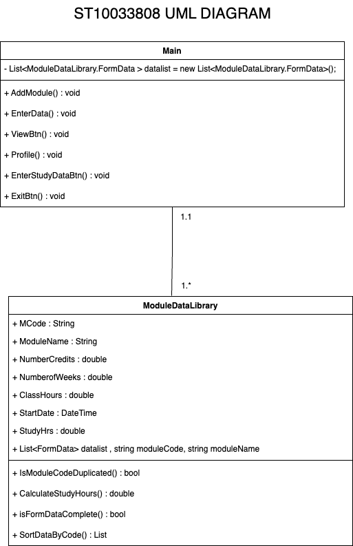

## Screenshots

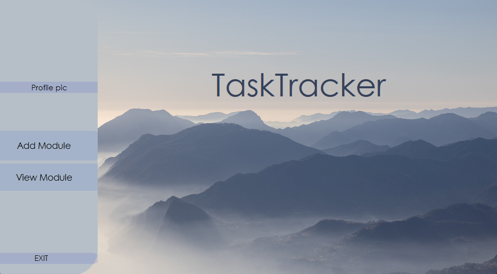
*Upon running the application you would be greeted with the above, this is the Home Page.*

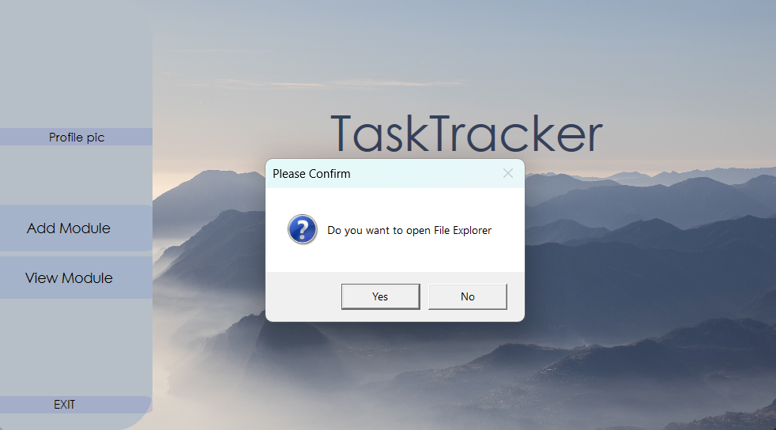
*Upon Pressing Profile pic this functionality enables users to add a picture of themselves, A MessageBox Appears prompting to Open File Explorer if the user Presses yes it will openFile explorer,if they press no it will Cancel the operation and the user can continue normally without a profile picture.*

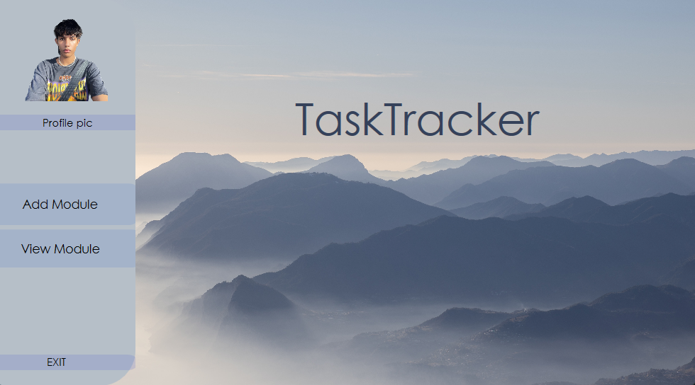
*When file explorer opens just select the image of you, Press add and it should display in reference to this screenshot.*

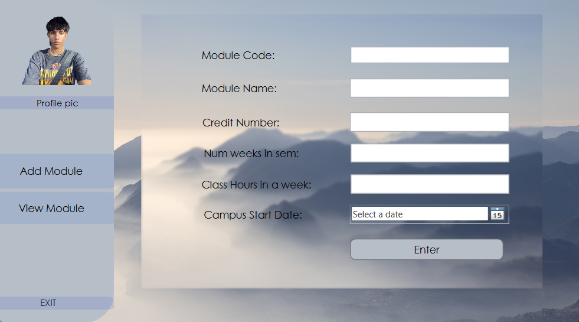
*Next, When Selecting the Add Module button this will open up a page on the right-center of the screen, where it will have multiple prompts relating to module details.*

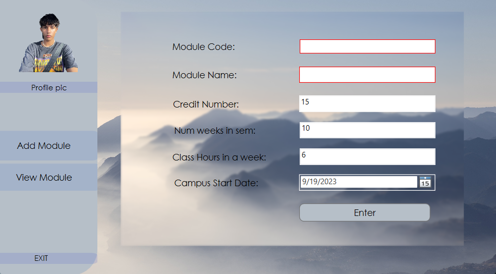
*When populating the Fields, and you dont fill in a field or you input an invalid format, the textbox will be highlighted in red prior to this you will be notified that there is an invalid character or you forgot to fill in the field, This is one of the many error handling in the application.*

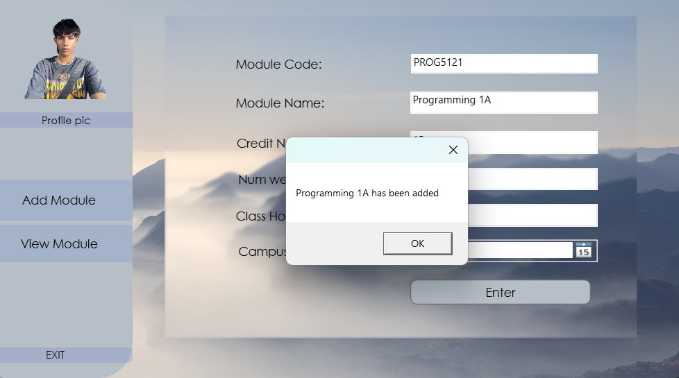
*After inputng valid data in all the prompt fields and pressing enter, you will get this pop up, indicating your module has been successfully added, then you can click 'ok' and proceed.*

*After adding a module, proceed to the View Module Button, which has 2 tabs located in it, one for reporting self studies and the other for Viewing your modules, in the sample provided this is the self studies tab, lets switch over to the View Modules tab.*

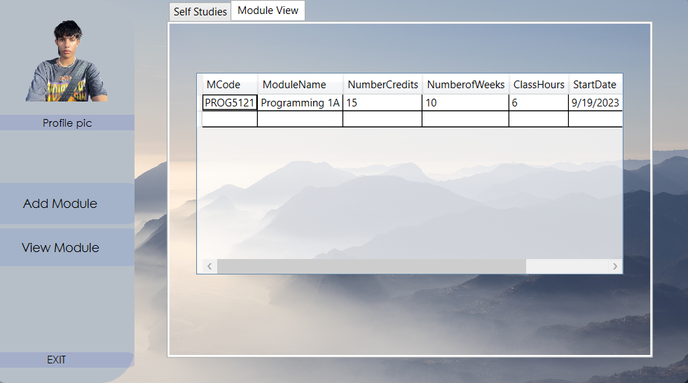
*The sample, is the DataGrid tab, here all your modules you added will be populated, as you can see the data we entered earlier is now populated here and based off our inputs our self studies is 9 Hours.*

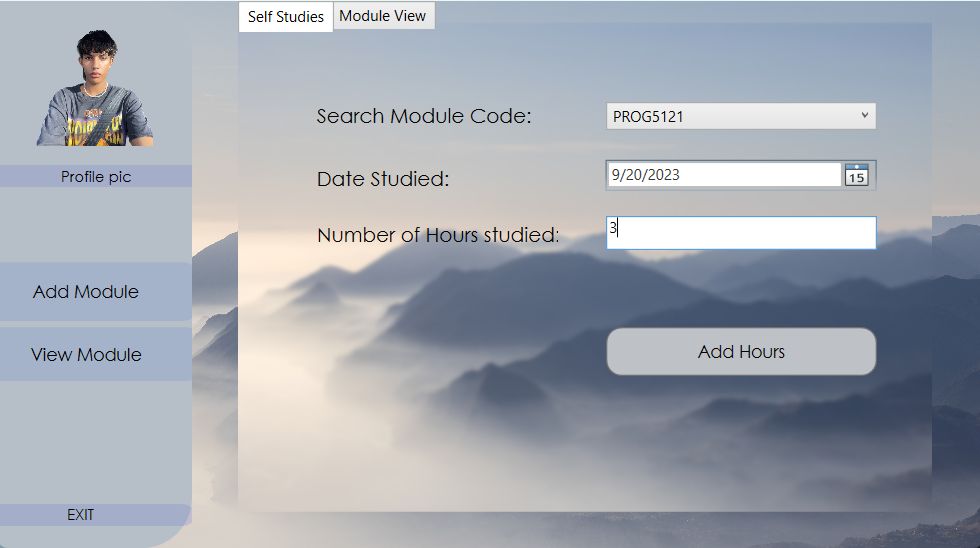
*Now going back to Self Studies tab, the module code you entered when adding a module, populates the combobox so you can select which module you added and the date you studied and how many hours you studied for, if that date is within the weeks of the module from its start date then it subtract, in the examples case it is within the week.*

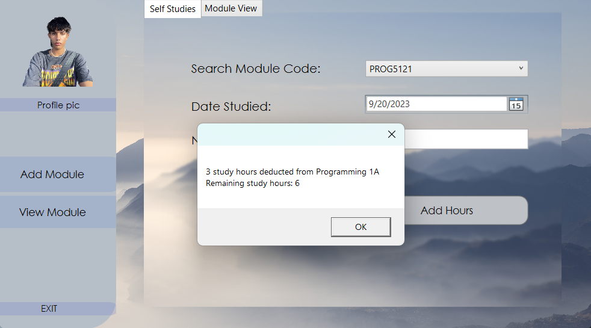
*Now the inputs are validated, you will get MessageBox popup detailing the operation that occured.*

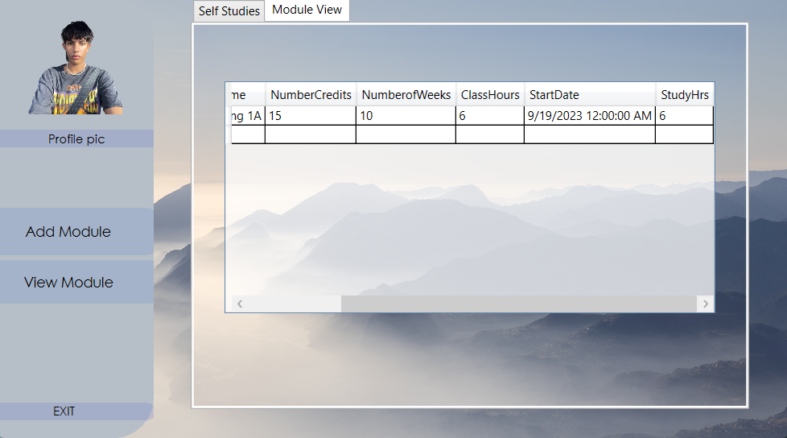
*if you go to the View Module Tab now it will show the self studies collumn updated with the new hours and that is the Application completed.*

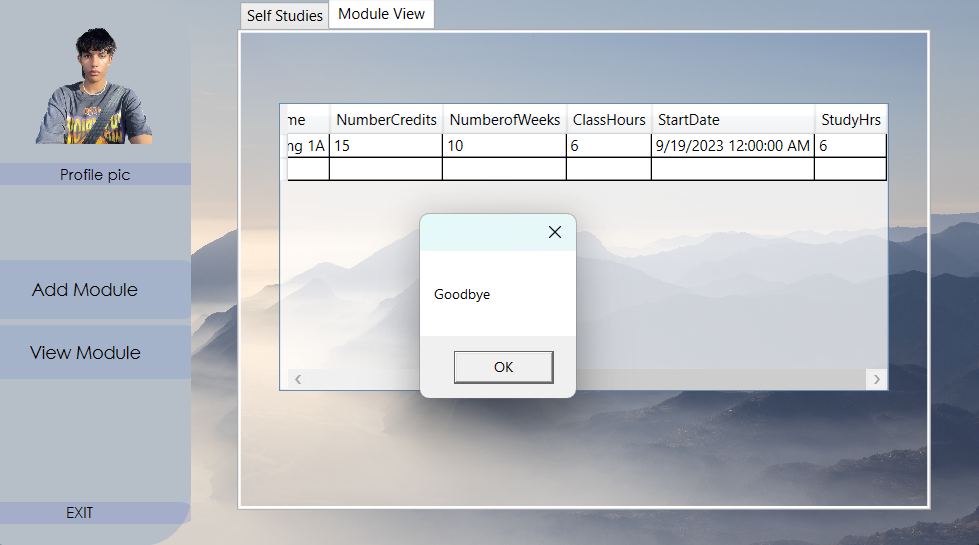
*Now you can exit the application, and it will look like this.*

## Roadmap

We have exciting plans for the future of this application. Here are some features and improvements we are considering:

- Integration with BackEnd Database.
- Login and Registration Functionality.
- Hashing and Multithreading of Data.

## Contributing

Contributions are welcome! If you would like to contribute to this project, please follow our [Contribution Guidelines](CONTRIBUTING.md).

## Authors

- Leighché Jaikarran

## License

This project is licensed under the MIT License - see the [MIT LICENSE](LICENSE) file for details.

## Acknowledgments

We would like to express our gratitude to the following individuals and resources that have contributed to or inspired this project:

- Denzyl Govender for invaluable guidance and support.
- The open-source WPF library community for making desktop application development accessible.
